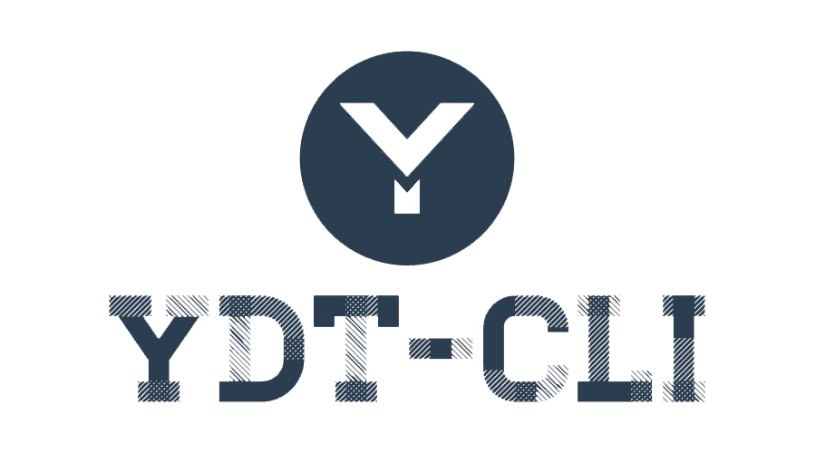
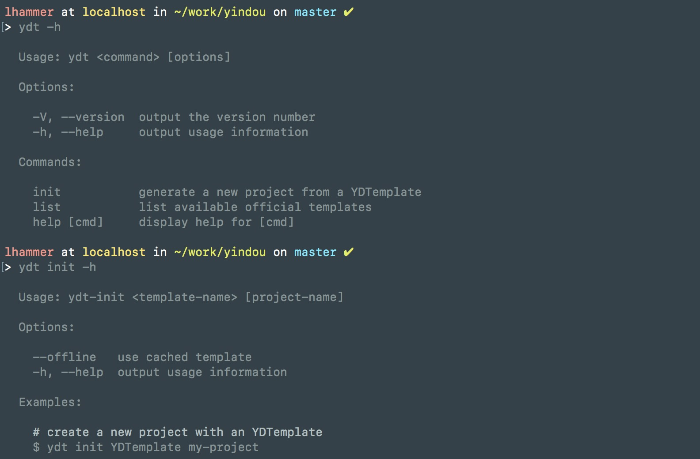

<p align="center">
    
    <p align="center">
        <a href="https://ci.appveyor.com/project/l-hammer/ydt-cli/branch/master" target="_blank"></a>
        <a href="https://www.npmjs.com/package/ydt-cli"></a>
        
        <a href="https://codeclimate.com/github/l-hammer/YDT-cli/maintainability"></a>
    </p>
    <p align="center">
        A simple CLI for scaffolding YDTemplate projects.
        <br>
    </p>
</p>

## Installation

Prerequisites: Node.js (>=8.x, 10.x preferred), npm version 5+ and [Git](https://git-scm.com/).

```bash
$ npm install -g ydt-cli
```

## Usage

```bash
$ ydt -h
$ ydt list
$ ydt init -h
$ ydt init <template-name> <project-name>
$ ydt init <template-name> <project-name> --offline
```

<div align="center"></div>

#### Example:

```bash
$ ydt list
```

list available official templates

<div align="center"></div>

```bash
$ ydt init YDTemplate my-project
```

The above command pulls the template from [l-hammer/YDTemplate](https://github.com/l-hammer/YDTemplate), prompts for some information, and generates the project at `./my-project/`.

<div align="center"></div>

```bash
$ ydt init YDTemplate my-project --offline
```

The above command pulls the template from local cached template([$HOME](https://www.npmjs.com/package/user-home)/.YDTemplates/YDTemplate), prompts for some information, and generates the project at `./my-project/`.

<div align="center"></div>

## Templates

> * [YDTemplate](https://github.com/l-hammer/YDTemplate) - A Flexible Template of Parcel + Vue/jQuery + Hot-reload + Node proxy/Mock data.

## Custom Templates

It's unlikely to make everyone happy with the official templates. You can simply fork an unofficial template and then use it via ydt-cli with:

```bash
$ ydt init username/<custom template> <project-name>
```

## Local Templates

Instead of a GitHub repo, you can also use a template on your local file system:

```bash
$ ydt init ~/path/<custom template> <project-name>
```

## Contributing 

- :fork_and_knife:Fork it!
- :twisted_rightwards_arrows:Create your branch: `git checkout -b my-new-feature`
- :wrench:Make your changes
- :memo:Commit your changes: `git commit -am 'Add some feature'`
- :rocket:Push to the branch: `git push origin my-new-feature`
- :tada:Submit a pull request

or submit an [issue](https://github.com/l-hammer/You-need-to-know-css/issues) - any helpful suggestions are welcomed. :stuck_out_tongue_winking_eye:

## License

[](https://app.fossa.io/projects/git%2Bgithub.com%2Fl-hammer%2FYDT-cli?ref=badge_small)

[MIT](https://github.com/l-hammer/You-need-to-know-css/blob/master/LICENSE) © 2018 LHammer